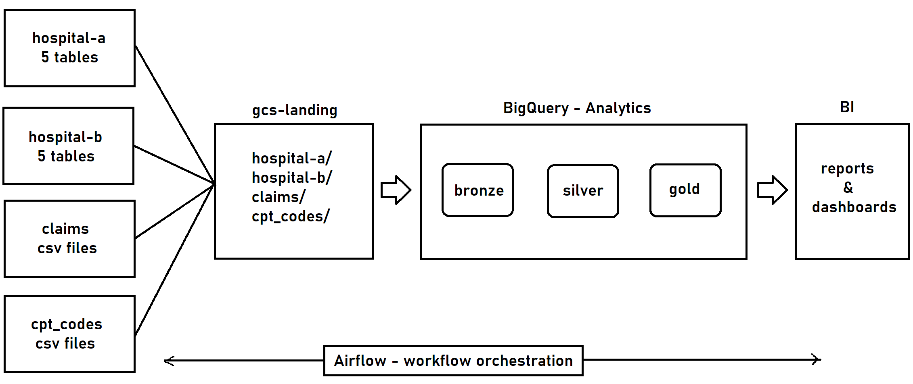
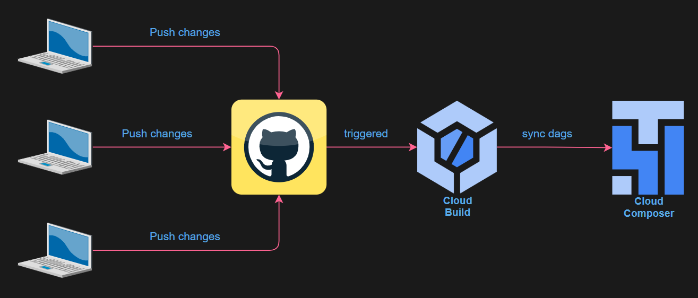

# Healthcare Revenue Cycle Management (RCM) – GCP Data Engineering Project

## 📖 Table of Contents
1. [Overview](#-overview)
2. [Architecture & Data Flow](#%EF%B8%8F-architecture--data-flow)
3. [Project Structure](#-project-structure)
4. [Technology Stack](#%EF%B8%8F-technology-stack)
5. [Key Features](#-key-features)
6. [Security Considerations](#-security-considerations)

## Overview

This project implements an end-to-end Data Engineering pipeline on Google Cloud Platform (GCP) for the Healthcare Revenue Cycle Management (RCM) domain.

The solution ingests data from multiple healthcare sources, processes it using a Medallion Architecture (Bronze → Silver → Gold), and delivers analytics-ready fact and dimension tables in BigQuery to support KPI reporting.

The entire project was designed with Cloud Composer (Airflow) as the orchestration core, ensuring modular workflows, clear task dependencies, and production-style scheduling patterns.

---

## Architecture Summary

## 🏗️ Architecture & Data Flow

### System Infrastructure
This diagram illustrates the cloud infrastructure and the flow of data from on-premise sources to the GCP analytical environment.


**Sources**
- Cloud SQL (Hospital A & B – EMR data)
- Claims flat files (GCS)
- Public APIs (CPT, ICD, NPI)

**Processing**
- PySpark jobs on Dataproc (data ingestion and raw processing)
- BigQuery transformations (Bronze, Silver, Gold layers)

## ⚙️ Data Processing Details

### Bronze Layer (Raw)
* **Strategy:** BigQuery External Tables.
* **Format:** JSON source files stored in GCS.
* **Reasoning:** Reduces storage overhead and ensures the Silver layer always pulls the latest raw data directly from the landing zone without redundant ingestion steps.

### Silver Layer (Cleansed)
* **Strategy:** BigQuery Native Tables.
* **Operations:** Schema enforcement, deduplication, and data type casting.

### Gold Layer (Curated)
* **Strategy:** Star Schema (Facts and Dimensions).
* **Logic:** Business logic application, SCD Type 2 tracking, and KPI aggregation.

**Orchestration**
- Cloud Composer (Airflow DAGs)
- Parent DAG coordinates the full workflow
- PySpark DAG handles ingestion jobs
- BigQuery DAG executes transformation layers

**CI/CD**
- Cloud Build trigger configured on repository updates
- Any change pushed to Git automatically:
  - Deploys DAGs to Composer
  - Uploads required data/SQL files to the Composer bucket
- Enables automated deployment and version-controlled workflows

This diagram details the Airflow DAG logic, showing how task dependencies are managed and how the CI/CD pipeline deploys assets.


---

## 📂 Project Structure

```text
GCP-HEALTHCARE-PROJECT-MAIN/
├── 📁 data/
│   ├── 📁 BQ/                # BigQuery SQL scripts (Bronze, Silver, Gold layers)
│   ├── 📁 claims/            # Raw Hospital claim CSV files
│   ├── 📁 configs/           # DDLs and load metadata
│   ├── 📁 cptcodes/          # CPT reference data
│   └── 📁 EMR/               # EMR data for Hospital A & B
│       ├── 📁 hospital-a/    # Source-specific DDLs and CSVs
│       └── 📁 hospital-b/    # Source-specific DDLs and CSVs
├── 📁 INGESTION/             # PySpark & Python ETL ingestion scripts
│   ├── claims.py
│   ├── cpt_codes.py
│   ├── hospitalA_mysqlToLanding.py
│   ├── hospitalB_mysqlToLanding.py
│   ├── icd_codes.py
│   └── npi_codes.py
├── 📁 utils/                 # Utility scripts (e.g., CI/CD helpers)
│   └── add_dags_to_composer.py
├── 📁 workflows/             # Airflow DAGs for orchestration
│   ├── bq_dag.py
│   ├── parent_dag.py
│   └── pyspark_dag.py
├── 📄 cloudbuild.yaml        # GCP CI/CD pipeline configuration
├── 📄 requirements.txt       # Python environment dependencies
├── 📄 LICENSE                # Project license
├── 📄 ProjectNotes.md        # Technical debt and development logs
└── 📄 README.md              # Main documentation
```
## Key Features

- Medallion Architecture (Bronze → Silver → Gold)
- PySpark ingestion via Dataproc
- BigQuery transformations with MERGE and SCD logic
- Cloud Composer (Airflow)–centric orchestration design
- Automated CI/CD deployment using Cloud Build triggers
- Star schema modeling for analytics
- Modular and production-style DAG structure

---

## Security Considerations

This repository contains sensitive information for demonstration purposes only.  
The project was built as a learning exercise and is not intended for production use.

In real-world scenarios:
- Credentials must be stored in environment variables or Secret Manager
- No passwords or IP addresses should be hardcoded
- IAM roles and least-privilege access should be enforced

---

## Technology Stack

- Python
- PySpark
- SQL
- Google Cloud Storage (GCS)
- Dataproc
- BigQuery
- Cloud Composer (Airflow)
- Cloud SQL
- Cloud Build

---

## Objective

Deliver a scalable, Composer-oriented, production-style data platform that transforms raw healthcare operational data into structured analytical datasets for financial and operational reporting.
